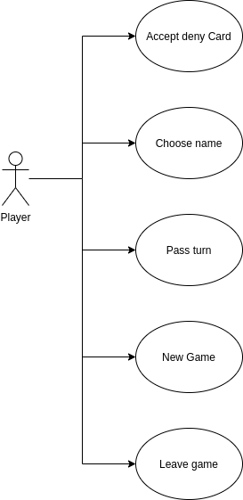

# **BINGO**

El juego del bingo se compone de un bombo con bolas numeradas, cartones con números aleatorios impresos y rotuladores o fichas para tachar o tapar estos. Una partida consiste en extraer las bolas del bombo al azar y cantar su respectiva numeración.
En este caso el juego genera un cartón de 15 númneros y en caso de que coincida el número del bombo con el uno del cartón, éste se sustituye por una "x".

## **FUNCTIONAL DESCRIPTION**
-Registrar el nombre del jugador.
-Genera un cartón con 15 numeros diferentes del 1 al 99.  
-New turn: Genera un numero, comprueba que no haya salido antes y lo compara con los del carton.  
-Lo sustituye por una "x" en caso de acierto.  
-Comprueba si hay Linea o Bingo.  
-Confirma que si el usuario quiere seguir jugando.

### **CARACTERISTICAS**

Utiliza funciones constructoras para crear instancias, y bucles para recorrer y comparar los numeros del carton y del bombo.

